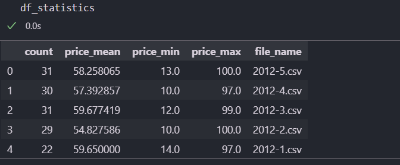

# Reto de Ingeniería de Datos - PRAGMA SAS


Este reto tiene como objetivo evaluar tu capacidad para construir un pipeline de datos que procese y analice información en tiempo real o casi real mediante la ingesta por microbatches.

## Especificaciones del Reto

## Datos:

Seis archivos .CSV con nombres "2012-1.csv", "2012-2.csv", ..., "2012-5.csv" y "validation.csv".
Cada archivo contiene tres campos: timestamp, price, user_id.
Los archivos .CSV están ordenados por hora.

## Requerimientos
1. Descargar la carpeta comprimida con los datos.

2. Construye un Pipeline de Datos:

* Carga todos los archivos .CSV excepto "validation.csv".
* Almacena los datos en una base de datos (PostgreSQL, MySQL, etc.).
* Realiza un seguimiento de:
    * Recuento de filas cargadas.
    *Valor medio, mínimo y máximo del campo "price".
    * Actualiza las estadísticas a medida que se cargan los datos.

3. Comprobación de Resultados:
* Impresión de Estadísticas: Imprime el valor actual de las estadísticas durante la ejecución del pipeline para monitorear el progreso.

* Consultas a la Base de Datos: Ejecuta consultas a la base de datos para obtener:

    * Recuento total de filas cargadas.
    * Valor promedio, mínimo y máximo del campo "price".

* Validación: Ejecuta el archivo "validation.csv" a través del pipeline y muestra el valor actualizado de las estadísticas.

* Consultas Adicionales: Realiza consultas a la base de datos nuevamente después de cargar "validation.csv" para verificar cómo cambian las estadísticas.

## Algunas reglas y consideraciones del reto:
* Puedes utilizar cualquier Framework o librería que desees.
* Puedes utilizar cualquier base de datos que desees, lo importante es  que muestres cómo te conectas a ella, cómo poblas la(s)
* tabla(s) y cómo realizas las consultas.
* Puedes hacer uso de alguna interfaz gráfica para
* administrar/manipular tu base de datos (ejemplo PgAdmin), o
* puedes hacer uso de línea de comandos.
* Puedes usar cualquier código existente que tengas a disposición.
* No hay una forma definida de resolver esta tarea. Queremos ver la forma en la que piensas para resolver un problema así.
* Las estadísticas se pueden almacenar de la forma que desees: en base de datos, en memoria, en un archivo.
* No te preocupes por el rendimiento, el objetivo es una solución funcional.
* Si no logras terminar, no te preocupes, queremos saber hasta dónde puedes llegar

## Entregables
Para este reto, te solicitamos por favor que nos hagas llegar en una carpeta .ZIP, o un enlace a algún repositorio en nube (ejemplo Drive), los siguientes
elementos:
- Notebook o script en donde tengas el pipeline escrito y documentado el  paso a paso.


# Solución propuesta

## Estructura del Proyecto GitHub
```css
├── Dockerfile
├── LICENSE
├── LICENSE copy
├── Makefile
├── README copy.md
├── README.md
├── docs
│   ├── index.md
│   └── tutorial.md
├── pyproject.toml
├── requirements.txt
├── scripts
│   ├── postgres.sql
│   └── publish.sh
├── setup.py
├── src
│   ├── main.py
│   ├── modules
│   │   ├── apis
│   │   │   ├── __init__.py
│   │   │   ├── amazon_api
│   │   │   ├── clockify
│   │   │   └── google_drive
│   │   │       ├── __init__.py
│   │   │       └── googledrive.py
│   │   └── clouds
│   │       ├── aws
│   │       │   └── __init__.py
│   │       ├── azure
│   │       │   └── __init__.py
│   │       └── gcp
│   │           └── __init__.py
│   └── support_gcp.py
└── tests
    ├── dataset_testing
    │   ├── 2012-1.csv
    │   ├── 2012-2.csv
    │   ├── 2012-3.csv
    │   ├── 2012-4.csv
    │   ├── 2012-5.csv
    │   └── validation.csv
    ├── integration
    │   ├── docker-compose.yaml
    │   ├── model
    │   ├── run.sh
    │   └── test_docker.py
    └── unit
        └── test_main.py
```
La estructura de archivos proporcionada para este proyecto cumple con estándares de seguridad y buenas prácticas de desarrollo. Aquí hay una breve descripción destacando algunos aspectos importantes:

- src/main.py: Este archivo contiene el punto de entrada principal de la aplicación. Aquí es donde se inicializan y se ejecutan los diferentes componentes del pipeline de datos.

-  src/modules/: Esta carpeta contiene los diferentes módulos de la aplicación, organizados por funcionalidad. Por ejemplo, en "apis" podrías encontrar los módulos para interactuar con distintas APIs (Amazon, Clockify, Google Drive), mientras que en "clouds" se encuentran los módulos relacionados con los servicios en la nube (AWS, Azure, GCP). Estos módulos están diseñados para ser modularizados y reutilizables, lo que promueve un diseño limpio y mantenible.

-  requirements.txt: Este archivo lista todas las dependencias de Python necesarias para ejecutar la aplicación. Al mantener este archivo actualizado, facilita la replicación del entorno de desarrollo en diferentes máquinas y contribuye a la reproducibilidad del proyecto.

- env: este archivo  podría contener configuraciones específicas del entorno, como variables de entorno o archivos de configuración sensibles. Es importante mantener esta información fuera del repositorio para evitar exponer datos sensibles, siguiendo buenas prácticas de seguridad.

- .gitignore: El archivo .gitignore es utilizado por Git para especificar qué archivos y directorios deben ser ignorados en el control de versiones. Su propósito es mantener limpio el historial de cambios del repositorio, evitando la inclusión de archivos generados automáticamente, archivos de configuración locales y datos sensibles. Se especifican patrones de nombres de archivos o directorios que se deben ignorar, lo que ayuda a mantener el repositorio ordenado y seguro

-  pre-commit hooks: Se han incluido ganchos pre-commit para evitar la inclusión de datos sensibles en GitHub utilizando ggshield, una herramienta que escanea los cambios antes de realizar un commit para buscar información confidencial. Esto ayuda a proteger la seguridad y privacidad de los datos del proyecto.

- Cumplimiento con PEP8: Se garantiza el cumplimiento de las convenciones de estilo de código de Python (PEP8) utilizando herramientas como pylint, black y isort. Esto asegura que el código sea legible y consistente, facilitando su mantenimiento y colaboración entre desarrolladores. El código se formatea automáticamente utilizando pre-commit hooks para garantizar que cumpla con las convenciones de estilo PEP8 de manera consistente. Esto significa que antes de cada commit, el código se ajusta automáticamente para mantener una estructura limpia y legible.

* Pruebas unitarias: Se incluyen algunas unitarias para garantizar que todas las funciones y componentes del pipeline de datos funcionen correctamente. Estas pruebas ayudan a identificar posibles errores o regresiones durante el desarrollo y a mantener la integridad del código a medida que se realizan modificaciones. Las pruebas unitarias también ayudan a controlar los cambios en el código y a garantizar que nuevas funcionalidades no introduzcan problemas inesperados.

-  En resumen, la estructura del proyecto y las prácticas implementadas contribuyen a la seguridad, el mantenimiento y la colaboración efectiva entre los miembros del equipo.


## Explicación del Código paso a Paso:
La solución del código se encuentra en la carpeta src, donde se alojan los archivos main.py y modules. Esto significa que la estructura de archivos se organiza de la siguiente manera:
```css
└── src
    ├── main.py
    ├── modules
    │   └── apis
    │       └── googledrive.py
```

Aquí, main.py contiene el código principal del pipeline de datos, mientras que googledrive.py dentro de la carpeta modules/apis proporciona la clase GoogleDriveAPI, que interactúa con la API de Google Drive. Esta estructura modular permite una mejor organización del código y facilita su mantenimiento y reutilización.


**googledrive.py**

    Inicialización de la clase GoogleDriveAPI: La clase GoogleDriveAPI se inicializa con la ruta al archivo de credenciales de servicio y el ID de la carpeta de Google Drive con la que se va a interactuar.

    Método list_files: Este método lista los archivos en una carpeta especificada dentro de Google Drive.

    Método download_file: Este método descarga un archivo de Google Drive y lo devuelve como un flujo de bytes.

    Método copy_and_delete_file: Este método copia un archivo a otra carpeta en Google Drive y luego elimina el archivo original.

    Método create_folder: Este método crea una nueva carpeta en Google Drive.

    Método share_folder_with_user: Este método comparte una carpeta en Google Drive con un usuario específico.

    Método upload_file: Este método sube un archivo a una carpeta en Google Drive.

**main.py**
    Carga de Variables de Entorno: El archivo comienza cargando las variables de entorno necesarias para la ejecución del pipeline desde un archivo .env.

    Inicialización del objeto GoogleDriveAPI: Se inicializa un objeto GoogleDriveAPI utilizando la clase definida en googledrive.py. Este objeto se utilizará para interactuar con la API de Google Drive.

    Obtención de la lista de id's archivos CSV: Se obtiene una lista de archivos CSV presentes en una carpeta específica de Google Drive utilizando el método list_files del objeto GoogleDriveAPI.

    Iteración sobre los archivos CSV: Se itera sobre cada archivo CSV obtenido en el paso anterior de manera independiente.

    Descarga y procesamiento del archivo CSV: Se descarga el archivo CSV utilizando el método download_file del objeto GoogleDriveAPI. Luego, se procesa el archivo CSV, convirtiendo las fechas y ejecutando un pipeline de datos para su carga en una base de datos por cada fila del csv cargado.

    Cálculo de estadísticas: Se calculan estadísticas básicas sobre el archivo CSV, de manera individual y completa del batch, como el número total de filas, el precio medio, mínimo y máximo.

    Almacenamiento de estadísticas: Las estadísticas calculadas se almacenan en una tabla de la base de datos utilizando un segundo pipeline de datos.

    Movimiento del archivo procesado: Una vez que el archivo CSV ha sido procesado, se copia a otra carpeta dentro de Google Drive y se elimina el archivo original.


## Precisiones sobre la solución:

- Punto de Entrada para Descarga de Archivos: Los archivos CSV con la estructura correcta se deben depositar en la carpeta compartida en Google Drive en el siguiente enlace: Carpeta Compartida de Entrada. Esta carpeta actúa como la puerta de entrada para que el usuario deposite los archivos que serán procesados.
    https://drive.google.com/drive/folders/1Igp_dLYVV29bJRMIJyQoRdcnI82PH1eK?usp=sharing

- Uso de la Biblioteca Python dlt: Se utiliza la biblioteca Python dlt para realizar ciertas operaciones en el código. dlt es una biblioteca que proporciona funcionalidades para la manipulación de datos, como la descarga y carga de archivos desde y hacia multiples sitios, de una manera, rapida, eficiente y liviana, entre otras utilidades.
https://drive.google.com/drive/folders/1HW6e5DgRqjpJGbSvBC1KvX62JVW-WAII?usp=sharing

- Destino de Archivos Procesados: Después de procesar los archivos, los resultados se dejan en otra carpeta en Google Drive. Puedes encontrar esta carpeta en el siguiente enlace: Carpeta Compartida de Salida. Los archivos procesados se colocarán aquí para que el usuario pueda acceder a ellos.

- Contenerización y Despliegue en la Nube: La solución es diseñada para ser contenerizada y desplegada en la nube. Puedes utilizar tecnologías como Docker para contenerizar la aplicación. Además, puedes orquestar y automatizar el flujo de trabajo utilizando herramientas como Apache Airflow, Prefect o Kubernetes. Esto permite una gestión eficiente de los recursos en la nube y una ejecución escalable de la solución.

- La solución respeta los principios ACID (Atomicidad, Consistencia, Aislamiento y Durabilidad) en la base de datos, garantizando la integridad y la consistencia de los datos en todo momento. Esto significa que:

- La solución crea y mantiene control de versiones de las tablas generadas durante la primera ejecución del sistema.

- Está conectada a una base de datos PostgreSQL en Google Cloud Platform (GCP). Sin embargo, cabe destacar que se podría haber optado por cualquier otro servicio de base de datos. La elección de PostgreSQL en GCP se debió a la disponibilidad de cuentas al momento de desarrollar la actividad.

### Comprobación de Resultados::

* Impresión de Estadísticas: Imprime el valor actual de las estadísticas durante la ejecución del pipeline para monitorear el progreso.
    ```python
    count	price_mean	price_min	price_max	file_name
	31	    58.258065	13.0	100.0	2012-5.csv
	30	    57.392857	10.0	97.0	2012-4.csv
	31	    59.677419	12.0	99.0	2012-3.csv
	29	    54.827586	10.0	100.0	2012-2.csv
	22	    59.650000	14.0	97.0	2012-1.csv
    ```
    Estas son las estadisticas para la ejecución de los cinco archivos archivos desde python. Adjunto imagen:
    
    Se destaca que cada archivo se sube de manera independiente y no al mismo tiempo, este solo es un consolidado.

* Consultas a la Base de Datos: Ejecuta consultas a la base de datos para obtener:

    * Recuento total de filas cargadas.
    ```sql
    SELECT COUNT(*) AS total_count,file_name   FROM chess_data.generic_fact_table
    GROUP BY _dlt_load_id, file_name
    ```
    ```sql
    #Respuesta usando pgadmin
    total_count file_name
        22	    "2012-1.csv"
        29	    "2012-2.csv"
        31	    "2012-5.csv"
        30	    "2012-4.csv"
        31	    "2012-3.csv"
    ```

    * Valor promedio, mínimo y máximo del campo "price":
    ```sql
    SELECT AVG(price), MIN(price), MAX(price), file_name FROM chess_data.generic_fact_table
    GROUP BY _dlt_load_id, file_name
    ```

    ```sql
    #Respuesta usando pgadmin en tabla de hechos (chess_data.generic_fact_table).
    "avg"	            "min"	"max"	"file_name"
    59.6500000000000000	14	    97	    "2012-1.csv"
    54.8275862068965517	10	    100	    "2012-2.csv"
    58.2580645161290323	13	    100	    "2012-5.csv"
    57.3928571428571429	10	    97	    "2012-4.csv"
    59.6774193548387097	12	    99	    "2012-3.csv"
    ```
    Se guardan estaditicas en tabla de estadisticas dentro de la misma bd, por batch:
    ```sql
    SELECT * FROM chess_data.statistics;
    #Respuesta de tabla de estadisticas dentro de la bd
    "count"	"price_mean"	"price_min"	"price_max"	"file_name"
    31	    58.25806451612903	13	    100	        "2012-5.csv"
    30	    57.392857142857146	10	    97	        "2012-4.csv"
    31	    59.67741935483871	12	    99	        "2012-3.csv"
    29	    54.827586206896555	10	    100	        "2012-2.csv"
    22	    59.65	            14	    97	        "2012-1.csv"
    ```

* Validación: Ejecuta el archivo "validation.csv" a través del pipeline y muestra el valor actualizado de las estadísticas.
    ```python
    count	price_mean	price_min	price_max	file_name
	8       41.75         11         92         validation.csv
    ```

* Consultas Adicionales: Realiza consultas a la base de datos nuevamente después de cargar "validation.csv" para verificar cómo cambian las estadísticas.
```sql
    #Respuesta usando pgadmin en tabla de hechos luego de la carga de datos de validacion.csv (chess_data.generic_fact_table).
    "avg"	            "min"	"max"	"file_name"
    59.6500000000000000	14	    97	    "2012-1.csv"
    54.8275862068965517	10	    100	    "2012-2.csv"
    58.2580645161290323	13	    100	    "2012-5.csv"
    57.3928571428571429	10	    97	    "2012-4.csv"
    59.6774193548387097	12	    99	    "2012-3.csv"
    41.7500000000000000 11      92      "validation.csv"
    ```
    Se guardan estaditicas en tabla de estadisticas dentro de la misma bd, por batch:
    ```sql
    SELECT * FROM chess_data.statistics;
    #Respuesta de tabla de estadisticas dentro de la bd
    "count"	"price_mean"	"price_min"	"price_max"	"file_name"
    31	    58.25806451612903	13	    100	        "2012-5.csv"
    30	    57.392857142857146	10	    97	        "2012-4.csv"
    31	    59.67741935483871	12	    99	        "2012-3.csv"
    29	    54.827586206896555	10	    100	        "2012-2.csv"
    22	    59.65	            14	    97	        "2012-1.csv"
    8       41.75               11      92          "validation.csv"
    ```
